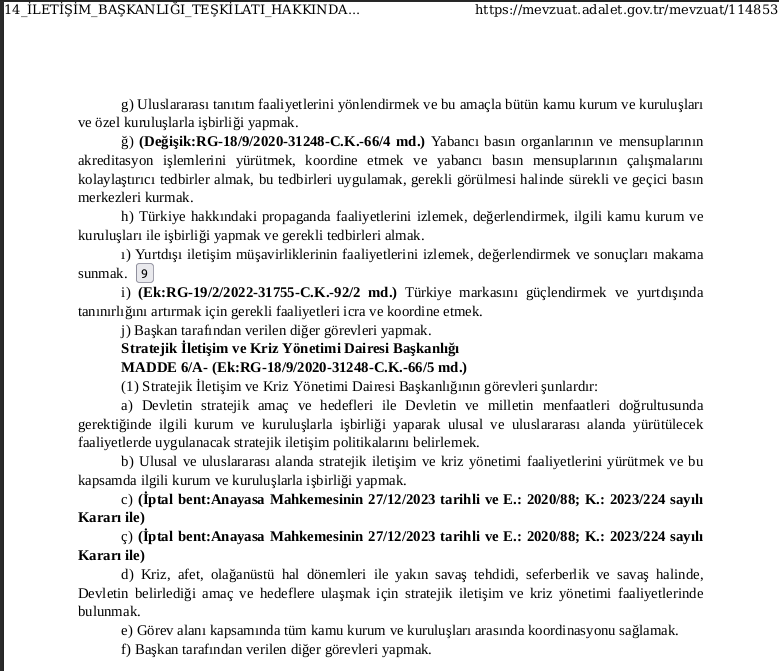
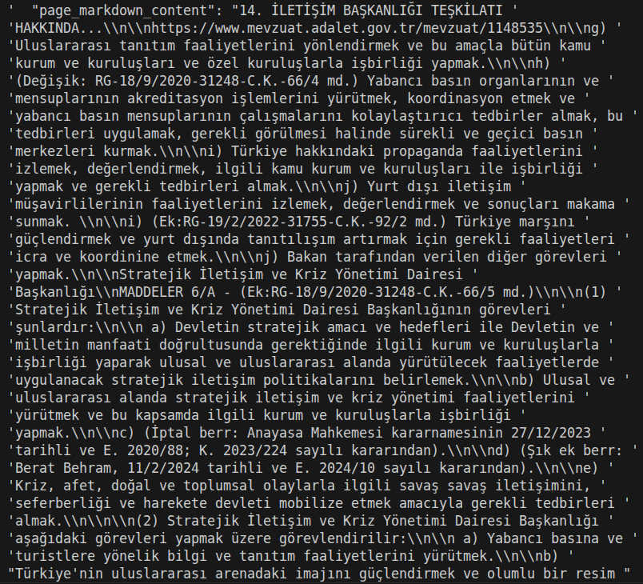
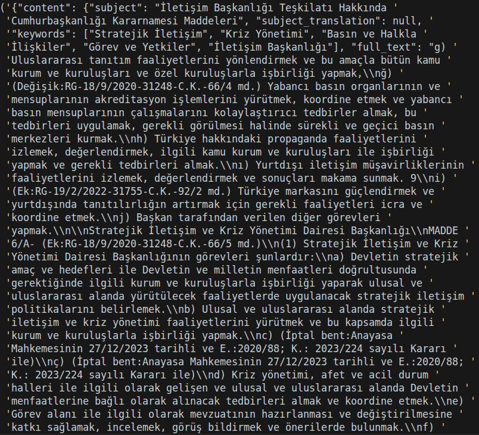

<h1 align="center">Beyond OCR: Finetuning VLM for Turkish Legal Documents</h1>

<p align="center">
  Sometimes we resort to Vision-Language Models (VLMs) to perform OCR on documents. If we are already using a VLM, we can benefit from its capabilities to extract more than just plain text. Instead of limiting the output to OCR, the model can also extract structured information such as stamps, person names, and the structural elements of the page like tables and lists.
</p>


## Table of Contents
1. [Usage](#usage)
    - [Clone the Repository](#1-clone-the-repository)
    - [Create conda environment](#2-create-conda-environment)
    - [Install Dependencies](#3-install-the-required-dependencies)
    - [Download Model Checkpoint](#4-download-the-model-checkpoint)

2. [Example Outputs](#example-outputs)
3. [Dataset](#dataset)
4. [Training Process](#training-process)
    - [Synthetic Data Generation](#1-Gemini-Outputs-(Synthetic-data-to-train-Gemma))
    - [Gemma3-4b-it Finetuning](#2-Gemma3-4b-it-Finetuning)
5. [Evaluation](#evaluation) 
    - [Gemma3-4b-it Output](#gemma_output)
    - [LoRA Output](#lora_output)


## Usage
---


### 1. Clone the repository
```bash
git clone https://github.com/HusamettinYilmazz/OCR_Turkish_Legal_Documents.git
```

### 2. Create conda environment
```bash
conda create -n ocr_vlm python=3.11; 
conda activate ocr_vlm
```

### 3. Install the required dependencies
```bash
pip install -r requirements.txt
```

### 4.Download the model checkpoint
#### Install huggingface_hub
```bash
pip install huggingface_hub
```
#### Download from huggingface
```python
from huggingface_hub import snapshot_download

checkpoint_hash = "918bf033daf5fc32bafa707a168d05b84daf3922"

path = snapshot_download(
        repo_id="husammm/V3",
        revision=checkpoint_hash,
        allow_patterns="last-checkpoint/*",
        local_dir=f"./loaded_checkpoints/{checkpoint_num}",
        local_dir_use_symlinks=False
        )
print(f"Local repo path: {path}")
```


## Example Outputs
---

Below is a comparison between:

- Raw PDF
- Output of base model (`gemma-3-4b-it`)
- Output of finetuned model (LoRA)

### PDF



---

### Base Model Output (without LoRA)



The base model produces incomplete extraction with wrong words.

---

### Finetuned Model Output (with LoRA)



finetuned model extracts almost exact words and data about the document like:
- Subject
- Key words
- Tables
- Lists
- Charts
- etc...

This is only a visual example. go to [Full Comparison](#full-comparison) for better evaluation
---

### Full Comparison

Full outputs for all evaluation images, including:

- Base model outputs
- Outputs of all LoRA checkpoints

are available in:
[evaluation](https://github.com/HusamettinYilmazz/OCR_Turkish_Legal_Documents/tree/main/experiments/evaluation)

Under:\
[base_outputs](https://github.com/HusamettinYilmazz/OCR_Turkish_Legal_Documents/tree/main/experiments/evaluation/base_outputs.jsonl) for Base model outputs\
[lora_outputs](https://github.com/HusamettinYilmazz/OCR_Turkish_Legal_Documents/tree/main/experiments/evaluation/lora_outputs.jsonl) for LoRA outputs (Use checkpoint: "1700" for the best output)

You can use these files to perform detailed comparison.


## Dataset
---

The dataset consists of publicly available Turkish legal documents, specifically:

- Presidential Decrees (*Cumhurbaşkanlığı Kararnameleri*)
- Presidential Circulars (*Cumhurbaşkanlığı Genelgeleri*)

These documents are published by the Turkish Ministry of Justice and are open for public access and use.

You can browse and download the original PDFs from:

**Adalet Bakanlığı Mevzuat Portalı**  
https://mevzuat.adalet.gov.tr/

## Training Process
---

### Gemini Outputs (Synthetic data to train Gemma)

Gemini-3 Flash was used to generate structured outputs from Turkish legal document images.
These outputs serve as synthetic training data for Gemma-3-4B-it.

OpenRouter was used to access Gemini-3 Flash and generation process.
The resulting dataset consists of image-prompt pairs and their corresponding structured JSON outputs.

---

### 2 Gemma3-4b-it Finetuning

Gemma-3-4B-it was finetuned using LoRA with the LlamaFactory framework.

Training was performed on Vast.ai using an RTX 5090 GPU (32GB VRAM).

Weights & Biases (wandb) was used to track:

- training loss  
- evaluation loss  
- learning rate  
- gradients  
- and overall training progress  

All training checkpoints were automatically pushed and stored on Hugging Face:

**Checkpoints repository:**  
<https://huggingface.co/husammm/V3>

